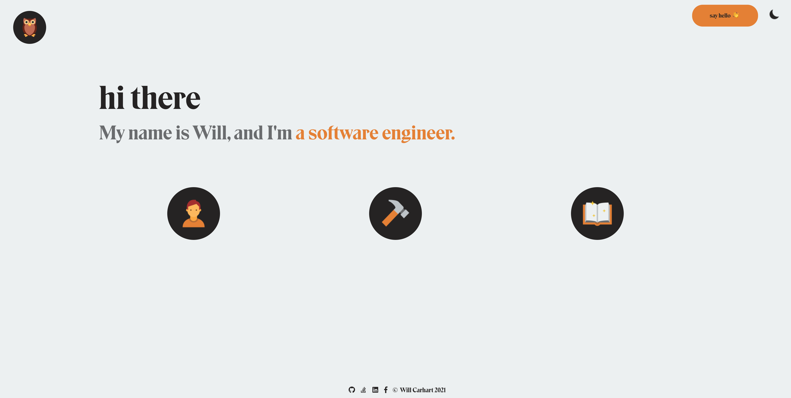

<h1 align="center">willcarh.art</h1>
<h5 align="center">Portfolio &nbsp;|&nbsp; Blog &nbsp;|&nbsp; Custom SSG</h5>
<p align="center">
  <a href="https://app.netlify.com/sites/willcarhart/deploys" target="_blank">
    
  </a>
</p>
<p align="center"></p>

#### [willcarh.art](https://willcarh.art) is Will Carhart's personal porfolio website, blog, and custom [static site generator](https://www.netlify.com/blog/2020/04/14/what-is-a-static-site-generator-and-3-ways-to-find-the-best-one/). It is built from scratch using Node.js and standard web technologies, and is hosted via [Netlify](https://netlify.com).

# Custom Static Site Generator
[willcarh.art](https://willcarh.art) is a statically generated site. It uses a custom Node.js generator to replace template HTML with content sourced from markdown files. If you'd like to understand my motivation for writing my own static site generator, please check out [the blog post](https://willcarh.art/blog/why-i-wrote-my-own-static-site-generator).

### Using the generator
Before starting, you'll need Node.js and Yarn. You can install them via [Homebrew](https://brew.sh/) with `brew install node` and `brew install yarn`.

To start a new build, use the forge. Dependencies will be auto-resolved upon first build attempt.
```bash
./forge --help
```
```
forge - build pages for willcarh.art

Usage:
forge [-h] [-b] [-d] [-s] [-v]
  -h, --help      Show this menu and exit
  -b, --browser   Open the newly built website in a new browser window
  -d, --develop   Do not exit on validation errors
  -s, --silent    Silence build output
  -v, --verbose   Show generated files as a result of forge
```
Create a new development build with `./forge --develop --verbose`.
```
👉  Building redirects...
🖋  Building scripts...
💄  Building styles...
🏠  Building home...
🗄  Building vault...
🏃‍♂️  Building demos...
💁‍♂️  Building about...
📖  Building blog...
🏗  Building projects...
👓  Building etc...
🤬  Building 404...
✨  Done in 0.647 seconds
```
If you take a look in `netlify.toml`, you'll see that the production build does not use development mode when running the forge: `./forge --verbose`.

# About the website
[willcarh.art](https://willcarh.art) was born out of my desire to have my own slice of the internet. It's changed over the years as I've coded more things. I hope you enjoy your visit 😊

Have questions or comments about the site? Shoot me a note:

&nbsp;&nbsp;&nbsp;&nbsp;&nbsp;&nbsp;📫 hello@willcarh.art

### Color palette
Like my theme? Here are the hex values. You can also find these on the [etc](https://willcarh.art/etc) page.
| Color | Light Mode | Dark Mode |
|-------|:----------:|:---------:|
|Main Background| `#ecf0f1`| `#292929`|
|Detail Background| `#bdc3c7`| `#34495e`|
|Main Text| `#252323`| `#ecf0f1`|
|Detail Text| `#6a6c6e`| `#8895a1`|
|Color| `#e67e22`| `#6642ac`|

### Licensing
All of the generator code found in `generator/` is licensed under the [MIT License](https://choosealicense.com/licenses/mit/), meaning you can use the generator to generate your own website without attribution and for commercial purposes. However, all other content of the site is licensed under the [Creative Commons BY-NC 4.0 License](https://creativecommons.org/licenses/by-nc/4.0/), meaning you can share and adapt the website content if you provide attribution and do not use it for commercial purposes. See [`LICENSE.md`](LICENSE.md).

# Etc.
This repository is for the most recent version of willcarh.art. For information on v1, please see the [v1 repository](https://github.com/wcarhart/willcarh.art-v1).

### Understanding this respository
The _forge_ ([`forge`](https://github.com/wcarhart/willcarh.art/blob/master/forge), [`generator/generator.js`](https://github.com/wcarhart/willcarh.art/blob/master/generator/generator.js)) generates webpages based on HTML, CSS, and JS templates. When a new version of the site is generated, the forge utilizes the files in `generator/` to build valid webpages and components in `src/`. It pulls templates from these directories:
* `templates/` - template HTML files for building the webpages in `src/`
* `js/` - template JS files to be included in `src/`
* `snippets/` - HTML and JS snippets from which to build content, used repeatedly throughout the website

And populates them based on files in from `content/`. In addition, static assets are linked from these directories:
* `css/` - static css files
* `font/` - static font files
* `ico/` - static icon files

In addition, the following files are utilized:
|File|Purpose|
|----|-------|
|`.eslintrc.json`|describes linting rules for Node.js|
|`.gitignore`|describes what items to ignore in git|
|`_redirects`|configures manual redirects for Netlify|
|`config.json`|the current configurations for the built website|
|`forge`|the file that invokes the generator|
|`LICENSE.md`|describes the project licenses|
|`logo.png`|project logo for GitHub README|
|`netlify.toml`|sets up build configurations for Netlify|
|`package.json`|standard package JSON generated by Yarn for the generator|
|`package-lock.json`|lockfile for `package.json`|
|`README.md`|the file, which describes the repository|
|`res.md`|resource file for miscellaneous notes and resources relevant to willcarh.art|
|`yarn.lock`|standard yarn lock file generated by Yarn to describe the dependencies of the generator|
